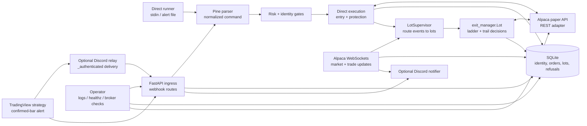
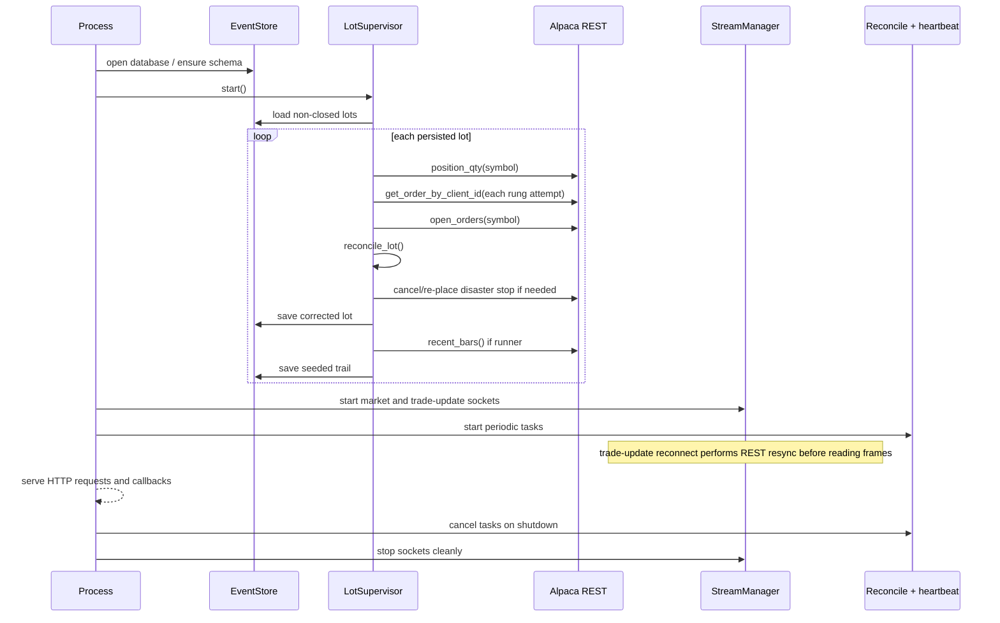
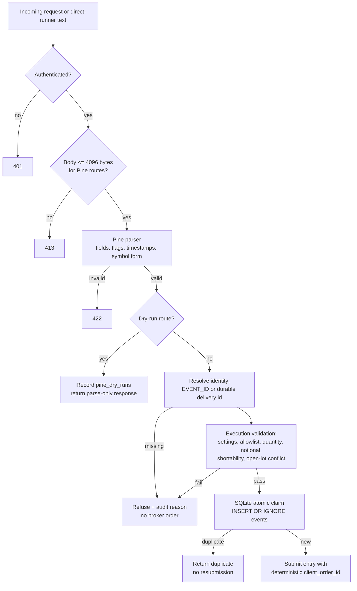
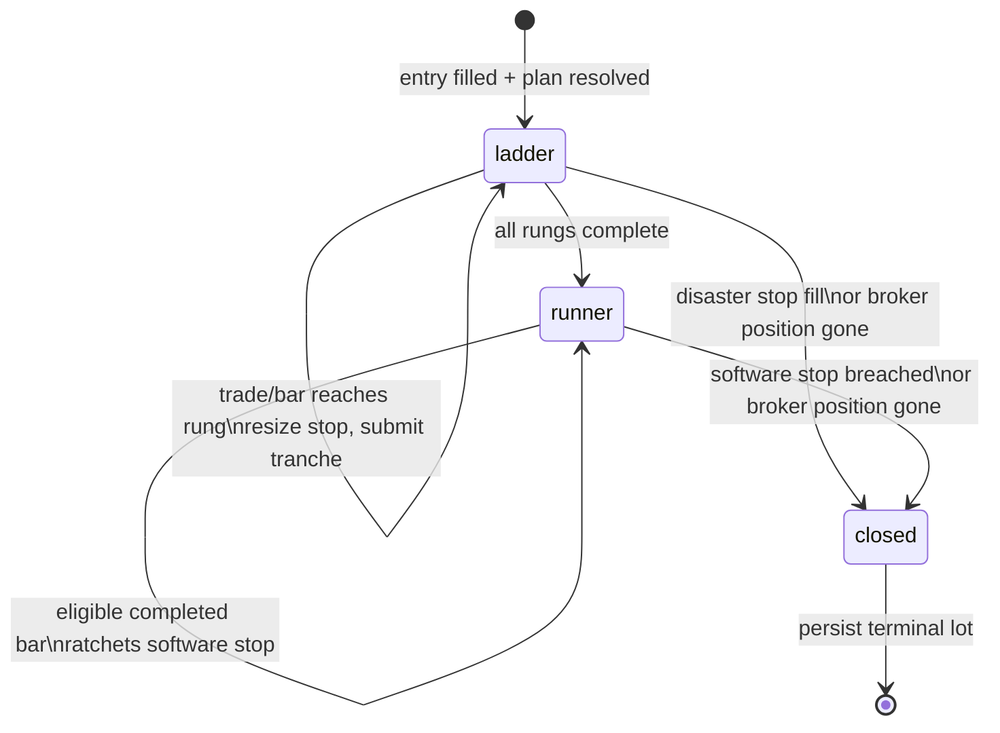
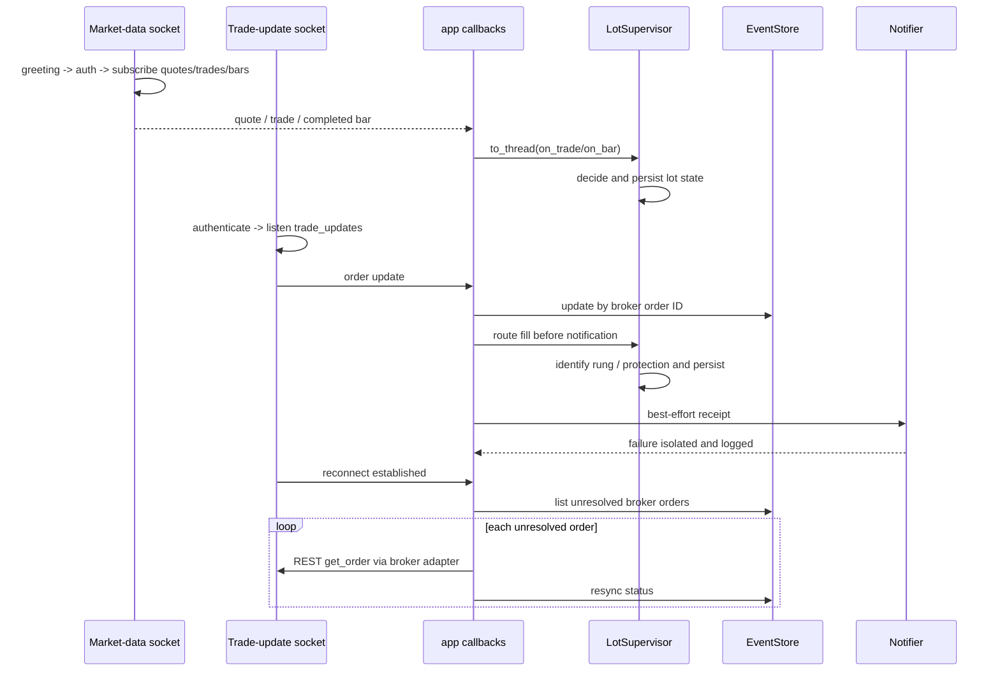
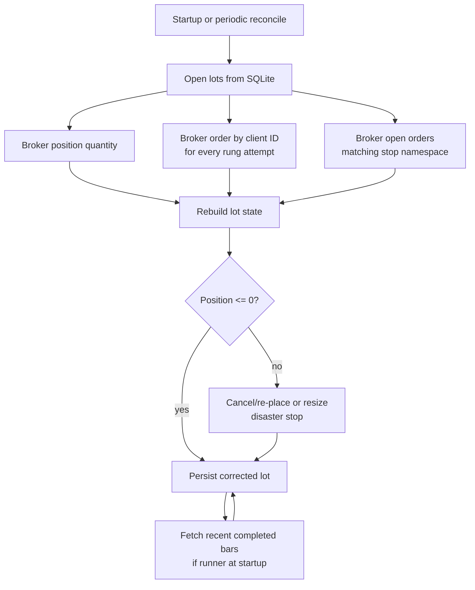

# TradingView → Alpaca Gateway Design

**Status:** living design document
**Scope:** paper-trading gateway, webhook/API ingress, direct execution, persistent streams, and managed exits
**Audience:** maintainers, reviewers, operators, and agents extending the gateway

This document describes the implemented architecture and the invariants that must remain true as the project grows. It is intentionally more detailed than the README: the README explains how to use the gateway; this document explains how the gateway is supposed to behave, where state lives, and which component owns each decision.

> **Safety boundary:** this repository is paper-only. `PAPER_TRADING=true` is mandatory and the configured Alpaca URL must be Alpaca's paper endpoint. This document does not authorize live trading.

## 1. Design goals

The gateway is designed around six goals:

1. **Fail closed before submission.** Unknown symbols, unsafe sizes, stale alerts, duplicate identities, unsupported asset/order combinations, and unconfirmed shortability must be refused before an order reaches Alpaca.
2. **Protect the measured position.** Protective quantity is derived from the broker position delta created by this entry, not from the requested quantity or an assumed fee schedule.
3. **Separate one-shot execution from continuous management.** Direct execution gets an entry protected; the lot supervisor owns a managed exit for as long as the process is alive.
4. **Treat the broker as the position fact.** SQLite is durable local state and an audit trail, but broker positions and orders win during reconciliation.
5. **Make every state transition observable.** Operators must be able to distinguish a quiet healthy system from a system that stopped receiving data or stopped routing fills.
6. **Keep strategy decisions deterministic and testable.** `exit_manager.py` decides; broker and stream adapters perform I/O.

## 2. System context



### Component responsibilities

| Component | Primary responsibility | Must not own |
|---|---|---|
| `app.py` | HTTP routes, application lifespan, callback wiring, health endpoint | Trading rules or duplicate execution logic |
| `pine_alert_parser.py` | Parse and normalize the executable Pine contract | Runtime allowlists, broker calls, risk approval |
| `risk.py` | Validate JSON-signal risk constraints | Submitting orders or managing exits |
| `execution.py` | One-shot entry, fill wait, measured protection, fallback flatten, managed-lot handoff | Market-event decisions after handoff |
| `exit_plans.py` | Named immutable plan definitions and fresh plan resolution | Per-price or per-fill decisions |
| `exit_manager.py` | Pure managed-lot decisions plus broker-effect calls through an injected adapter | Web routing, WebSocket parsing, SQLite queries |
| `lot_supervisor.py` | Maintain open lots, route market/order events, persist after actions, reconcile | Strategy geometry and raw WebSocket protocol |
| `stream.py` | Alpaca WebSocket protocols, reconnects, typed events | Risk approval and lot geometry |
| `broker.py` | Alpaca SDK/REST adapter, symbol normalization, broker models | Strategy policy and local state persistence |
| `store.py` | SQLite identity, refusal, broker-order, and lot durability | Broker truth or market decisions |
| `notifier.py` | Best-effort human receipts | Order state, fill routing, stream liveness |
| `config.py` | Environment parsing and paper-only validation | Dynamic strategy state |

## 3. Process lifecycle

The FastAPI lifespan establishes recovery before opening streams. This ordering is deliberate: a persisted lot may have a missing or cancelled stop, and waiting for the first market tick would leave it exposed.



### Runtime health

`/healthz` reports configuration, running commit, worktree dirtiness when detectable, and stream state. A connected socket is necessary but not sufficient for a healthy strategy: heartbeat and market counters show whether data is actually arriving. Credentials, webhook secrets, database paths, and other sensitive values are intentionally excluded.

## 4. Ingress and identity

The gateway has three ingress paths:

1. **Pine dry-run:** authenticate and parse only; records a parse audit but never evaluates risk or calls Alpaca.
2. **Pine submit:** authenticate, parse, and delegate to `execute_pine_command()` in a worker thread.
3. **Legacy JSON webhook:** authenticate, parse a `Signal`, apply risk approval, and submit a one-shot limit order.

The direct runner uses the same parser, execution engine, broker adapter, store, supervisor, and streams as the Pine submit route. It is not a second trading implementation.



### Identity invariants

- `EVENT_ID` is the business identity of a firing when supplied.
- A relay delivery ID may be used as a durable fallback when `EVENT_ID` is absent.
- Hashing order fields is not an identity strategy: identical strategy signals are expected to occur more than once.
- An alert with neither identity is refused rather than assigned a shared default.
- The identity used for broker client IDs is namespaced as `pine-exec-<identity>`.
- Broker client IDs must be deterministic for retries and unique for legitimate partial-fill top-up attempts.
- Fill routing must normalize the namespace on both the lot event ID and the extracted client-order event ID. A parser or naming change must never make a real rung fill appear unmanaged.

## 5. Direct execution and protection

`execution.py` is the one-shot safety boundary. Its critical sequence is:

```mermaid
flowchart TD
    Start[execute_pine_command]
    Validate[Validate paper config,\nkill switch, allowlist, size, notional]
    Short{Managed sell?}
    Shortable[Confirm asset shortable\nwhole-share equity only]
    Busy{Managed lot already\nopen for symbol?}
    Before[Read position_before]
    Submit[Submit market entry]
    Filled{Filled?}
    Wait[Poll until deadline]
    Cancel{Cancellation requested?}
    CancelOrder[Cancel unfilled entry]
    Unfilled[Return unfilled/canceled]
    After[Read position_after]
    Delta[held_qty = position_after - position_before]
    Plan{Managed exit plan?}
    NativeOCO[Submit native equity OCO]
    Lot[Construct Lot from broker fill\n+ plan snapshot]
    Arm[Place disaster stop\nfrom measured held quantity]
    Retry{Protection succeeds?}
    RetryProtect[One retry]
    Flatten[Flatten measured position]
    Critical[Raise UnprotectedPositionError\nand expose entry ID]
    Done[Return execution result]

    Start --> Validate
    Validate -- fail --> Refuse[Record refusal / raise]
    Validate --> Short
    Short -- yes --> Shortable
    Shortable -- false/unknown --> Refuse
    Shortable --> Busy
    Short -- no --> Busy
    Busy -- yes --> Refuse
    Busy -- no --> Before
    Before --> Submit
    Submit --> Filled
    Filled -- no --> Wait
    Wait --> Filled
    Filled -- no --> Cancel
    Cancel -- yes --> CancelOrder --> Unfilled
    Cancel -- no --> Unfilled
    Filled -- yes --> After
    After --> Delta
    Delta --> Plan
    Plan -- native equity OCO --> NativeOCO
    NativeOCO --> Done
    Plan -- managed software lot --> Lot
    Lot --> ArmManaged[Place disaster stop\nfor managed lot]
    ArmManaged --> ManagedRetry{Protection succeeds?}
    ManagedRetry -- no --> ManagedRetryProtect[Retry once]
    ManagedRetryProtect --> ManagedRetry
    ManagedRetry -- yes --> Handoff[supervisor.adopt(lot)]
    Handoff --> Done
    ManagedRetryProtect -- exhausted --> ManagedFlatten[Flatten measured position]
    ManagedFlatten -- success --> Done
    ManagedFlatten -- failure --> Critical
    Plan -- ordinary protection --> Arm[Place ordinary protection\nfrom measured held quantity]
    Arm --> Retry{Protection succeeds?}
    Retry -- no --> RetryProtect[Retry once]
    RetryProtect --> Retry
    Retry -- yes --> Done
    RetryProtect -- exhausted --> Flatten[Flatten measured position]
    Flatten -- success --> Done
    Flatten -- failure --> Critical
```

### Protection rules

- Protection uses `position_after - position_before`; this handles partial fills and in-kind crypto fees without assuming a fee rate.
- The protective order is normally `gtc`, so an overnight position is not left behind by a day-only stop.
- Equity can use a native trailing stop or native OCO where the requested plan supports it.
- Crypto does not support Alpaca's ordinary stop/trailing order types used by this gateway; crypto protection is stop-limit and managed ladders are software-supervised.
- If a managed plan cannot be armed, the implementation falls back to an ordinary protective stop rather than leaving the position naked.
- If protection fails, retry once. If it still fails, flatten the measured position. If flattening fails, surface an unmistakable unprotected-position error.

## 6. Managed exit architecture

### Plan definitions

`exit_plans.py` is a named configuration table. `resolve()` returns a fresh immutable `ExitPlan` object; an open lot snapshots that object so editing configuration does not re-price a position already in the market.

Current named plans:

| Plan | Shape | Target source | Runner |
|---|---|---|---|
| `DYNAMIC_TRAIL` | 20% at `1.2R`, 30% at `2.5R`, 50% remainder | R-multiples from actual fill | Previous completed bar low/high |
| `DYNAMIC_TRAIL_FAST` | 20% at `0.2R`, 30% at `0.4R`, 50% remainder | R-multiples from actual fill | Previous completed bar low/high |
| `OCO_AFTER_FILL` | 100% one target | Explicit alert prices | None |

The direction is carried as a sign rather than duplicated long/short logic:

```text
sign = +1 for long, -1 for short
R = sign * (entry_price - initial_stop)
target = entry_price + sign * multiple * R
reached = sign * (price - target) >= 0
breached = sign * (price - stop) <= 0
exit side = sell for long, buy for short
```

### Lot state machine



A lot contains entry and risk facts, plan snapshot, direction, quantities, working stop, broker stop ID, stop generation, rung attempts/order IDs, seen fill identities, stage, and trail context. Decimal strings are persisted; quantities and prices must not pass through binary floating-point state on their way to an order.

### Event decision flow

```mermaid
flowchart LR
    Q[Quote] --> Counters[Market counters]
    T[Trade] --> Counters
    B[Completed bar] --> Counters
    Counters --> Route[Supervisor routes by normalized symbol]
    Route --> Lot[Matching Lot]
    Lot --> Price[on_price / on_bar]
    Price --> Rung{Rung reached?}
    Rung -- yes --> Reserve[Cancel old disaster stop\nplace smaller disaster stop]
    Reserve --> SubmitTP[Submit market tranche exit]
    SubmitTP --> Fill[Trade update]
    Fill --> Account[on_fill cumulative quantity\n+ fill dedupe]
    Account --> Complete{Entire rung filled?}
    Complete -- no --> Persist[Persist partial state]
    Complete -- yes --> BE[Optional breakeven]
    BE --> Next{All rungs filled?}
    Next -- no --> Persist
    Next -- yes --> Runner[Enter runner]
    Runner --> Trail[Previous completed eligible bar]
    Trail --> Stop{Software stop breached?}
    Stop -- yes --> CancelPending[Cancel pending rung exits]
    CancelPending --> Unreserve[Cancel disaster stop]
    Unreserve --> Remainder[Submit remainder market exit]
    Remainder --> PersistClosed[Persist closed]
    Persist --> Store[(SQLite)]
    PersistClosed --> Store
```



### Ordering constraints

1. **Resize before partial exit.** Alpaca's resting stop reserves quantity. The tranche must be freed before its market order can be submitted.
2. **Never widen the disaster stop.** It is the broker-side floor. It may be resized smaller after a partial exit, but the price remains the original disaster level.
3. **Software breakeven/trailing is distinct from the broker stop.** The software stop is a number in the lot and causes a market exit when breached; it does not automatically modify the broker stop price.
4. **Trail only eligible completed bars.** A long uses the bar low; a short uses the bar high. Quote-only bars do not move the trail. The candidate is monotonic in the profitable direction.
5. **A rung completes on cumulative fill quantity.** Partial fills remain managed, and fill identities are deduplicated.
6. **Clamp exits to broker-held quantity.** Independent lots are a gateway abstraction; Alpaca has one position per symbol. A stale local quantity must not create an oversized exit.
7. **Persist after every meaningful action.** The broker order may already exist during the small decision-to-persistence window; reconciliation is the recovery mechanism for that window.

## 7. Streams and event routing

There are two independent Alpaca WebSocket protocols:

- Market data: quotes, trades, and bars on an equity feed endpoint, plus a separate crypto endpoint.
- Trading updates: `trade_updates` on the paper trading endpoint.

They have different handshake payloads and response shapes. They are not merged into one protocol or one connection. Alpaca account/feed connection limits mean another process using the same account can contend for the available market-data and trade-update slots.



### Failure isolation

- A notifier failure is not an order failure and must not prevent supervisor routing.
- An order-update callback failure must not tear down a healthy WebSocket; it is logged and the stream remains connected.
- Reconnect backoff is bounded and only resets after a stable connection.
- Reconnect resynchronization runs before consuming new trade-update frames because Alpaca does not replay updates missed while disconnected.
- A stream marked `connected` means the socket handshake succeeded; heartbeat and market counters are the data-arrival signal.

### Order ownership

The account's trade-update stream contains orders placed by more than one gateway subsystem, and potentially by other systems. Local direct-execution records and supervisor-owned records have different lifecycles:

| Order role | Typical owner | Local tracking |
|---|---|---|
| Entry | `execution.py` | `events` + `broker_orders` |
| Initial protection | direct execution or lot arm | `broker_orders` and lot state |
| Replacement protection | `Lot` / `LotSupervisor` | lot state + `broker_orders` where recorded |
| Take-profit rung | `Lot` / `LotSupervisor` | lot rung maps and client-order IDs |
| Software-stop remainder | `Lot` / `LotSupervisor` | lot state and broker update |
| Native OCO | direct execution | `broker_orders` |
| Foreign order | another process/operator | no local ownership; must be distinguishable in logs |

The stable ownership boundary is the `pine-exec-` client-order namespace. Unknown broker order IDs are not automatically faults: the order ID store is not the complete ownership registry. However, the gateway should classify its own supervisor-owned updates separately from truly foreign orders so warnings remain actionable.

## 8. Persistence and reconciliation

SQLite stores four different kinds of facts:

| Table | Meaning |
|---|---|
| `events` | idempotency claim and primary event status |
| `refusals` | append-only refusal audit, intentionally outside the claim namespace |
| `broker_orders` | one row per broker order and role for reconnect resync |
| `lots` | serialized managed-lot state, including closed history |
| `pine_dry_runs` | parse-only audit records, never execution claims |



Reconciliation is a safety net, not the primary fill path. If a normal fill is only reflected after the 60-second timer, the system is functioning eventually but not correctly: breakeven, quantity accounting, and the next exit may all be delayed. Therefore broker history must be compared with gateway decision/action logs, not inferred from the final position alone.

## 9. Safety and failure matrix

| Failure | Immediate behavior | Recovery / operator signal |
|---|---|---|
| Invalid or stale alert | Reject before broker | HTTP error and refusal/audit record |
| Duplicate event ID | Return duplicate; no resubmit | Store claim proves idempotency |
| Entry never fills | Wait deadline; optionally cancel | Entry status recorded |
| Entry fills but protection fails | Retry once, then flatten | Critical unprotected-position error if flatten fails |
| Unknown shortability | Refuse managed short | Explicit refusal; no broker submission |
| Fractional equity managed short | Parser refusal | Use whole shares; ordinary fractional closes remain valid |
| Crypto managed short | Parser refusal | Alpaca crypto spot is not shortable |
| Symbol not subscribed | Do not arm managed ladder; ordinary protection fallback | Error/refusal explains missing stream subscription |
| Stream disconnect | Mark down, bounded reconnect | Reconnect resyncs unresolved orders; health/logs expose state |
| Missed trade update | Periodic/startup reconciliation | Broker is source of truth; state corrected |
| Notification HTTP 403/error | Log warning and continue | Does not affect fills or stream |
| Pending rung and software stop breach | Cancel pending rung orders, remove stop reservation, exit remainder | Lot closes and persists |
| Broker position differs from local lot | Clamp/reconcile to broker-held quantity | Heartbeat and reconciliation logs expose correction |
| Foreign account order | Must not be routed to a local lot | Actionable warning once ownership classification is implemented |

## 10. Observability contract

### Normal log levels

- `INFO`: startup/version, stream lifecycle, fills, protection creation/resizing, rung submissions/completions, breakeven, trail moves, remainder exits, reconciliation outcomes, and heartbeats.
- `DEBUG`: meaningful state comparisons, parser/execution decisions, order metadata, and stream protocol details.
- `WARNING`: refusals, degraded protection, reconnects, failed notifications, and unexpected external state.
- `ERROR`/`CRITICAL`: inability to protect or flatten, invalid configuration, persistent connection-limit failures, and other operator-action conditions.

Raw quote/trade/bar firehose is opt-in through `LOG_MARKET_DATA=true`. `LOG_LEVEL=DEBUG` must remain usable during paper tests.

### Required evidence for a managed trade

For each managed event, the logs and/or store should make it possible to answer:

1. Which alert identity was accepted?
2. Which broker entry filled, and for what measured quantity/price?
3. What disaster stop was placed and what quantity did it reserve?
4. Which rung was reached, which order was submitted, and what filled?
5. Was protection resized before the exit?
6. When did breakeven or runner stage begin?
7. Which completed bar moved the software trail?
8. Why and how was the remainder closed?
9. What did reconciliation later confirm or correct?

The operator should verify these facts independently against Alpaca order history, fills, positions, and open orders. A quiet final outcome is not proof that every intermediate action occurred.

## 11. Extension rules

When adding a feature:

1. Identify whether it is a parser contract, risk rule, broker capability, state transition, stream event, or observability concern.
2. Add the rule at the narrowest owner: parser for syntax, risk for pre-submit policy, `execution.py` for entry/protection lifecycle, `exit_manager.py` for lot decisions, `lot_supervisor.py` for routing/persistence, and `broker.py` for Alpaca protocol details.
3. Preserve the one-way handoff: after a managed lot is adopted, direct execution must not continue managing it.
4. Give every broker order a deterministic, namespaced client-order ID and record its role/ownership.
5. Define restart behavior before implementing the happy path. State must be reconstructible from SQLite plus broker position/order history.
6. Add a regression test for the failure mode, not only the successful branch.
7. Add action logs for gateway-initiated decisions; broker update logs alone are insufficient.
8. Verify paper-only configuration and avoid credentials, live URLs, or live-account assumptions in tests and documentation.
9. Run the full suite in an isolated worktree when the change affects execution, streams, persistence, or managed exits.

## 12. Non-goals and known boundaries

- This gateway is not a strategy optimizer or profitability claim.
- The submit route still performs synchronous fill waiting; production-grade asynchronous job/outbox behavior remains a future boundary.
- Software-supervised crypto exits cannot provide the same process-death behavior as a broker-native OCO. The broker disaster stop is the surviving floor.
- SQLite is local durable state, not a distributed lock or multi-process ownership service. One account should not be operated by competing gateways without an explicit ownership design and uncontested Alpaca stream slots.
- The gateway does not infer ownership from broker order IDs alone; client-order namespace and local records are required.
- Health checks do not replace broker reconciliation or an operator review of order history.

## 13. Source map

| Design area | Authoritative files |
|---|---|
| HTTP lifecycle and callbacks | `src/tv_alpaca_gateway/app.py` |
| Pine syntax and command model | `src/tv_alpaca_gateway/pine_alert_parser.py` |
| One-shot execution and protection | `src/tv_alpaca_gateway/execution.py` |
| Managed lot decisions | `src/tv_alpaca_gateway/exit_manager.py` |
| Named plans | `src/tv_alpaca_gateway/exit_plans.py` |
| Lot routing, persistence, reconciliation | `src/tv_alpaca_gateway/lot_supervisor.py` |
| SQLite schema and queries | `src/tv_alpaca_gateway/store.py` |
| Alpaca REST/SDK adapter | `src/tv_alpaca_gateway/broker.py` |
| WebSocket protocols and reconnects | `src/tv_alpaca_gateway/stream.py` |
| Runtime configuration and logging | `src/tv_alpaca_gateway/config.py` |
| Contract/regression tests | `tests/` |

This document should be updated whenever ownership, order sequencing, persistence semantics, or failure recovery changes. A code change that invalidates a diagram or invariant is incomplete until the design document is updated too.
