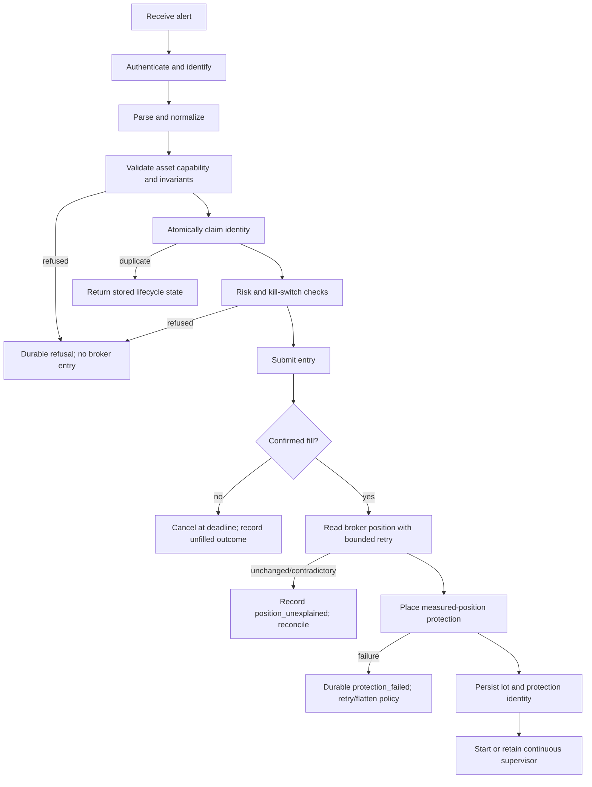

# TradingView Alert Contract

**Status:** Draft
**Scope:** Pine alerts received by the gateway, plus the legacy JSON route and relay boundary.
**Safety boundary:** Paper trading only. This document is a contract and review baseline; it is not live-trading approval.
**Audience:** TradingView/Pine authors, relay maintainers, gateway maintainers, reviewers, and operators.

## 1. Design principles

1. **One alert has one stable identity.** A delivery retry or duplicate message must not create a second entry.
2. **Protection is part of execution, not an optional notification.** A confirmed fill must result in measured-position protection, or in a durable failure state and safe flatten/reconciliation path.
3. **Broker state is authoritative for position quantity.** Local event and lot state explains the gateway's intent; it does not replace broker position truth.
4. **Quotes are not fills.** Lots and protection are created only after a broker-confirmed fill.
5. **Fail closed before broker submission.** Unknown plans, contradictory prices, unsupported asset-class/order combinations, stale alerts, and invalid identity are refused before an entry order.
6. **Asset-class differences are capability differences.** The strategy names the protection intent; the broker adapter chooses a supported order representation.
7. **A process restart must not make an open position invisible.** Any fill/protection ambiguity must be durable and recoverable.
8. **An alert must not act on foreign account state.** The account may be shared with another system; ownership and broker order identity must be explicit.

## 2. Ingress and identity

### 2.1 Supported ingress paths

| Path | Content | Default behavior | Contract status |
|---|---|---|---|
| Pine dry-run | `text/plain` pipe-delimited command | Parse and normalize only; no risk, broker, or protection call | Current and preferred validation path |
| Pine submit | `text/plain` pipe-delimited command | Authenticate, validate, claim identity, risk-check, submit entry, manage fill/protection | Current execution path |
| Legacy JSON webhook | JSON `Signal` object | Existing authenticated direct order path without full Pine protection semantics | Deprecated; migrate callers, then default-disable/remove |
| Relay | Approved Discord source forwarded unchanged | Defaults to Pine dry-run; execution requires explicit opt-in | Separate process; gateway remains Discord-independent |

The gateway must not infer executable meaning from a Discord username, channel label, message formatting, or a display name. The relay owns source admission; the gateway owns alert parsing and execution safety.

### 2.2 Identity fields

An executable alert must have at least one canonical identity:

- `EVENT_ID=<1..256 character stable event identity>` in the alert, or
- a validated generic delivery identity such as `X-Delivery-ID` supplied by the relay.

`X-Discord-Message-Id` is a temporary compatibility alias only. If both generic and legacy headers exist, the generic identity wins. Missing identity must be refused before broker submission.

`EVENT_ID` identifies the intended trading event; the delivery identity identifies the transport delivery. They are related but not interchangeable. An implementation may record both.

**Important:** `EVENT_ID={{ticker}}-{{interval}}-{{time}}` is only safe if the timestamp identifies the alert event, not merely the source bar. Entry and exit alerts generated on the same bar require distinct event identities. Pine templates must not reuse a per-bar identity for multiple independent actions.

### 2.3 Duplicate behavior

| Condition | Required result |
|---|---|
| Same identity received before broker submission | Atomically claim once; later delivery is a duplicate refusal/acknowledgement without a second entry |
| Same identity received after accepted/filled entry | Never resubmit; return the stored lifecycle state |
| Different identity, same symbol, existing managed lot | Apply configured same-symbol/risk policy; do not silently evict or replace the existing lot |
| Same alert retried after timeout | Reconcile event, broker order, position, lot, and protection state before any retry |
| Same bar, distinct legitimate entry and exit | Distinct event identities are mandatory |

A duplicate response must be truthful: it must distinguish `duplicate`, `in_progress`, `filled`, `protection_pending`, `protection_failed`, `position_unexplained`, and `flattened` rather than returning generic acceptance.

## 3. Common Pine syntax

The executable prefix is exactly one occurrence of:

```text
EXECUTE_ALPACA_ORDER
```

Fields use pipe delimiters and `KEY=VALUE` syntax. Whitespace around fields is ignored. Unknown executable fields and duplicate executable fields fail closed.

### 3.1 Common fields

| Field | Required | Values / meaning |
|---|---:|---|
| `SYMBOL` | yes | Allowlisted equity ticker or crypto pair; `BTCUSD` normalizes to `BTC/USD` |
| `SIDE` | yes | `BUY` or `SELL`; authoritative entry direction |
| `QTY` | yes | Positive decimal; fractional equity sells cannot open shorts |
| `ORDER_TYPE` | yes | Currently `MARKET` only |
| `TIME_IN_FORCE` | yes | Broker-supported value; equity and crypto capabilities differ |
| `EVENT_ID` | strongly required | Stable event identity; required for safe execution unless an approved delivery identity is present |
| `BAR_TIME` | optional/currently supported | Freshness checked when supplied |
| `CANCEL_UNFILLED_AT_DEADLINE` | optional | Explicit cancellation policy for an unfilled entry |
| `STOP_TRIGGER` | conditional | Initial protective stop trigger |
| `STOP_LIMIT` | conditional | Numeric stop-limit price or literal `NONE` for equity stop-market |
| `TRAIL` | optional | `NONE` or supported equity trail distance |
| `EXIT_PLAN` | conditional | Known managed plan name |
| `INTERVAL` | conditional | Required by bar-driven managed plans; must be nonzero and parseable |
| `TAKE_PROFIT` | conditional | Explicit target price where the selected plan requires/supports it |

`REQUIRED_ACTIONS` and `DO_NOT_SUMMARIZE_OR_REPOST_BEFORE_BROKER_CALL` are non-executable instruction fields. They must never weaken parser or execution validation.

## 4. Alert types

### 4.1 Bare entry alert

Example:

```text
EXECUTE_ALPACA_ORDER | SYMBOL=QQQ | SIDE=BUY | QTY=1 | ORDER_TYPE=MARKET | TIME_IN_FORCE=DAY | EVENT_ID=qqq-entry-20260821-093001
```

Semantics:

- Submits only the requested entry after authentication, allowlist, risk, freshness, and idempotency checks.
- It does not create a managed lot.
- It does not imply protection. It is therefore unsuitable for unattended strategy execution unless an external protection contract is explicitly accepted.
- If the entry fills and no protection was requested, the receipt must clearly state `unmanaged_entry`.

The legacy JSON route must not be used for new strategy alerts because its six-field `Signal` model cannot express protection, stop direction, exit plans, or ownership semantics.

### 4.2 Standalone protective-stop alert

Example for an equity stop-market:

```text
EXECUTE_ALPACA_ORDER | SYMBOL=QQQ | SIDE=BUY | QTY=10 | ORDER_TYPE=MARKET | TIME_IN_FORCE=GTC | EVENT_ID=qqq-protect-1 | PLACE_PROTECTIVE_STOP_AFTER_FILL | STOP_TRIGGER=700 | STOP_LIMIT=NONE
```

Semantics:

- `PLACE_PROTECTIVE_STOP_AFTER_FILL` requests protection after the entry fills.
- It does not create a managed ladder lot by itself.
- Protection quantity is measured from the broker-held position, not blindly copied from the requested entry quantity.
- A failed protection attempt is retried according to the execution contract; if protection cannot be established, the system must durably record the failure and follow the flatten/reconciliation policy.

Required fields: `STOP_TRIGGER` and `STOP_LIMIT` (with the equity `NONE` exception below).

### 4.3 Named managed-plan alert

Example:

```text
EXECUTE_ALPACA_ORDER | SYMBOL=QQQ | SIDE=SELL | QTY=10 | ORDER_TYPE=MARKET | TIME_IN_FORCE=GTC | EVENT_ID=qqq-short-20260821-093001 | EXIT_PLAN=DYNAMIC_TRAIL_FAST | INTERVAL=1m | STOP_TRIGGER=713.90 | STOP_LIMIT=NONE
```

Semantics:

1. Validate the plan name against `exit_plans.names()` before broker submission.
2. Require the plan's fields, including `STOP_TRIGGER` and `INTERVAL` where applicable.
3. Submit the entry.
4. Wait for a confirmed broker fill; `accepted`, `new`, or `pending_new` is not a fill.
5. Read the broker position, retrying position reads when propagation lag is possible.
6. Establish initial protection before opening/arming the managed lot.
7. Persist the lot, protection order identity, and lifecycle events durably.
8. Start/retain the continuous supervisor required by the plan. `DYNAMIC_TRAIL_FAST` must not be run with `--once`.

If the fill is confirmed but the position never moves in the entry direction after bounded retries, record `position_unexplained` as an error state. Do not silently treat it as an empty position. The operator must reconcile the shared account before retrying.

### 4.4 Native/managed OCO alert

Example for equity:

```text
EXECUTE_ALPACA_ORDER | SYMBOL=QQQ | SIDE=BUY | QTY=1 | ORDER_TYPE=MARKET | TIME_IN_FORCE=DAY | EVENT_ID=qqq-oco-1 | EXIT_PLAN=OCO_AFTER_FILL | STOP_TRIGGER=700 | STOP_LIMIT=NONE | TAKE_PROFIT=740
```

Semantics:

- Requires `STOP_TRIGGER` and `TAKE_PROFIT`.
- `TAKE_PROFIT` is an absolute target, not an R-multiple.
- For equity, `STOP_LIMIT=NONE` means a stop-market protective leg.
- For a numeric `STOP_LIMIT`, direction must be valid:
  - long protective stop-limit: `STOP_LIMIT <= STOP_TRIGGER`;
  - short protective stop-limit: `STOP_LIMIT >= STOP_TRIGGER`.
- The implementation may use native OCO only where the broker and asset class support it. Otherwise it must use an explicitly managed equivalent or refuse before entry; it must never submit a malformed native order and hope the fallback repairs it.
- A short OCO must validate both stop and target direction. A target that would immediately scale out in the wrong direction is invalid.

### 4.5 Stop-market capability contract

`STOP_LIMIT=NONE` is an explicit request, not the same as omitting the field.

| Asset class | Broker order emitted for `NONE` | Parser result |
|---|---|---|
| Equity | `type=stop`, `stop_price=STOP_TRIGGER`, no limit price | Accepted |
| Crypto | No supported stop-market representation | Refused before entry/protection submission |
| Equity with numeric limit | `type=stop_limit` with both prices | Accepted if direction checks pass |
| Crypto with numeric limit | `type=stop_limit` with both prices | Accepted if direction checks pass |

This is a broker capability rule owned by the parser/execution adapter, not strategy logic. Any future asset class must declare its supported protection order types instead of adding another symbol-specific conditional.

## 5. Validation matrix

Validation occurs before broker entry submission unless explicitly marked as post-fill.

| Rule | Refuse when |
|---|---|
| Prefix | Missing or repeated execution prefix |
| Identity | No valid event or delivery identity |
| Plan | `EXIT_PLAN` is unknown |
| Entry | Non-market `ORDER_TYPE` until entry-price fields exist |
| Quantity | Nonpositive, unsupported fractional short, or outside risk limits |
| Freshness | Timestamp is stale or malformed |
| Managed plan | Missing `STOP_TRIGGER`, required `INTERVAL`, or plan-specific field |
| Standalone protection | Missing `STOP_TRIGGER`; crypto missing numeric `STOP_LIMIT` |
| Stop-market | Crypto uses `STOP_LIMIT=NONE` |
| Direction | Stop/limit/target prices are inverted for `SIDE` |
| OCO | Missing `TAKE_PROFIT` or contradictory protective flag |
| Runtime mode | Live credentials/URL, disabled trading, or failed paper-only guard |
| Ownership | Proposed action would operate on an order/position not owned by this event/system |

The parser must not encode a field as “valid” merely because a later broker call can reject it. Broker rejection after a fill is a protection incident, not normal validation.

## 6. Lifecycle and failure contract



### 6.1 Required durable states

At minimum, the event lifecycle must distinguish:

```text
received
claimed
broker_submitted
broker_pending
broker_filled
position_unexplained
protection_submitted
protection_failed
lot_opened
unfilled_cancelled
flatten_submitted
flattened
reconciliation_required
```

`broker_filled` must not be treated as terminal if protection, lot creation, or ownership reconciliation is incomplete. A restart scanner must find a confirmed fill with no completed protection/lifecycle record, even when no lot row exists yet.

### 6.2 Restart and shutdown

- Shutdown must drain completion work for a bounded period and report unresolved protection at `CRITICAL`.
- Cancellation of an async wrapper does not guarantee cancellation of an underlying thread; the durable state must reflect that uncertainty.
- Startup reconciliation must scan broker orders and positions as well as local lots/events.
- A naked broker position must not be hidden by a terminal event, missing lot row, or duplicate event claim.
- Reconciliation must never close foreign positions or cancel foreign orders.

## 7. Managed-exit invariants

1. **Fill before lot:** no managed lot exists solely because an entry was accepted.
2. **Measured protection:** protection quantity comes from the confirmed broker-held position.
3. **Signed direction:** broker shorts are negative quantities; local lot quantities use an explicit direction conversion.
4. **Resize before partial exit:** reduce/replace protection before submitting a rung exit.
5. **Breakeven direction:** long and short comparisons are separate and tested.
6. **Completed bars ratchet:** bar-based dynamic trails use eligible completed bars, not an unclosed bar.
7. **Tick checks remain continuous:** rung breaches and software-stop breaches are not limited to bar closes.
8. **No silent lot eviction:** same-symbol races and restart adoption preserve every broker-owned lot or raise reconciliation-required state.
9. **Foreign-order safety:** broker order IDs and client identities are used to distinguish gateway-owned orders from another system's orders.
10. **Failure visibility:** every protection failure, cancellation, contradiction, or notifier failure has durable/logged evidence.

## 8. Operator receipt requirements

A successful submission receipt must include, without secrets:

- event and delivery identity;
- normalized symbol, side, and requested quantity;
- broker entry order ID and current status;
- protection mode (`stop`, `stop_limit`, native OCO, managed plan);
- protection order ID(s), if submitted;
- lifecycle state and whether continuous supervision is required;
- explicit warnings for `position_unexplained`, `protection_pending`, `protection_failed`, `reconciliation_required`, or unmanaged entry.

A receipt must never claim “protected” from a request intent alone. It requires broker order evidence.

## 9. Compatibility and migration

1. Keep the Pine dry-run route as the canonical parser test boundary.
2. Migrate relay and end-to-end callers from the legacy JSON route to Pine submit/dry-run.
3. Mark the JSON route deprecated and add a default-off execution gate before removal.
4. Preserve generic delivery identity and legacy-header compatibility during migration.
5. Do not introduce another alert format without adding it to this matrix and proving duplicate, fill, protection, restart, and foreign-order behavior.

## 10. Verification requirements for a new alert type

A new alert type is not complete until it has:

- parser acceptance and refusal tests;
- direction/property tests for long and short prices;
- duplicate delivery tests using both canonical and compatibility identities;
- pending, partial, filled, rejected, and cancelled entry tests;
- stale-position-read and unchanged-position contradiction tests;
- protection order-shape tests for every supported asset class;
- protection failure and flatten/reconciliation tests;
- restart test after fill-before-protection and after protection-before-lot persistence;
- shared-account/foreign-order tests;
- same-bar entry/exit identity tests;
- a paper dry-run probe and, only with explicit authorization, a paper execution probe;
- full local suite and CI evidence.

Current independent-review concerns that remain separate from the stop-market contract are tracked as safety work, not silently assumed solved: startup recovery after fill-before-lot, stale position reads, partial/rung reconciliation, shared-account ownership, short OCO direction, and per-bar event identity.

## 11. Source map

| Contract area | Authoritative implementation/tests |
|---|---|
| Pine parsing and validation | `src/tv_alpaca_gateway/pine_alert_parser.py`, `tests/test_pine_alert_parser.py`, `tests/test_parser_direction_contract.py` |
| Execution and protection | `src/tv_alpaca_gateway/execution.py`, `tests/test_execution_contract.py` |
| Plans and ladder semantics | `src/tv_alpaca_gateway/exit_plans.py`, `src/tv_alpaca_gateway/exit_manager.py`, `tests/test_exit_plan_alert_contract.py`, `tests/test_short_ladder_contract.py` |
| Persistence and recovery | `src/tv_alpaca_gateway/store.py`, `tests/test_submit_route_contract.py` |
| Routes and shutdown | `src/tv_alpaca_gateway/app.py`, `tests/test_submit_route_contract.py` |
| Relay boundary | `src/tv_alpaca_relay/`, `tests/test_relay_contract.py`, `tests/test_relay.py` |
| Direct runner safety | `src/tv_alpaca_gateway/direct_runner.py` |
| Repository operating rules | `AGENTS.md`, `README.md` |
